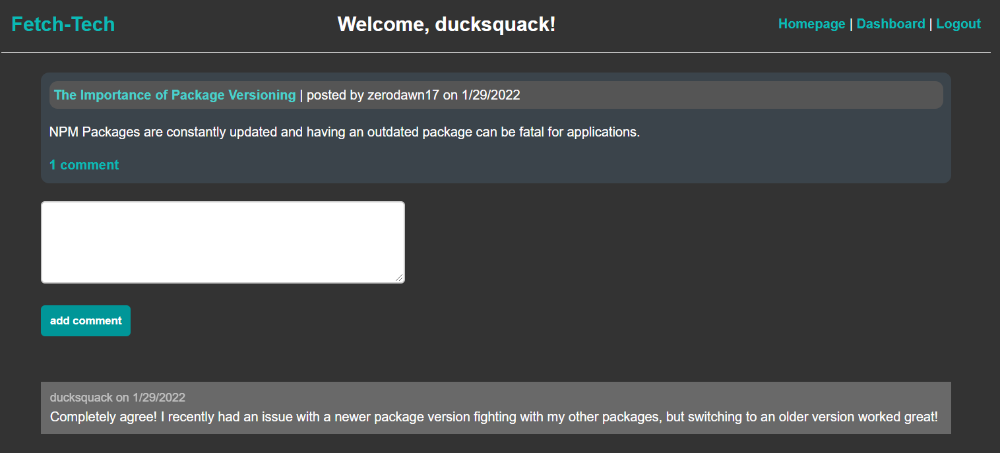
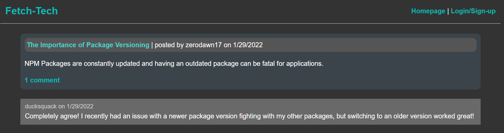

# fetch-tech

## Description
Fetch-Tech is a spot for users to create and share tech related posts within the tech community. Logged in users have access to a dashboard of all their posts where they can make changes or create new posts. Non-logged in users can see existing posts on the homepage.

_App Sample Screenshots_

### Access

Check out the live deployed site [here](https://tranquil-spire-73034.herokuapp.com/).

Alternatively, clone the repository, login to MySQL Shell and run source db/schema.sql to set up the database then run npm start.

### Future Enhancements Roadmap

* display character count for post content form input
* add hooks in User model to check for preexisting usernames on signup
